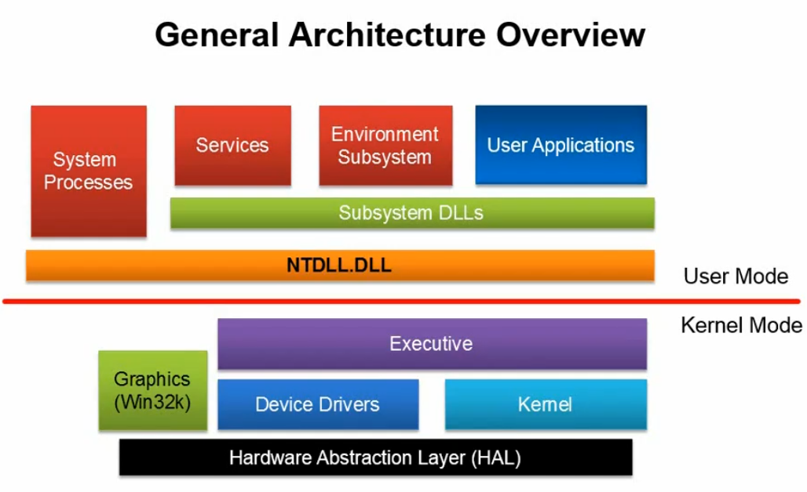
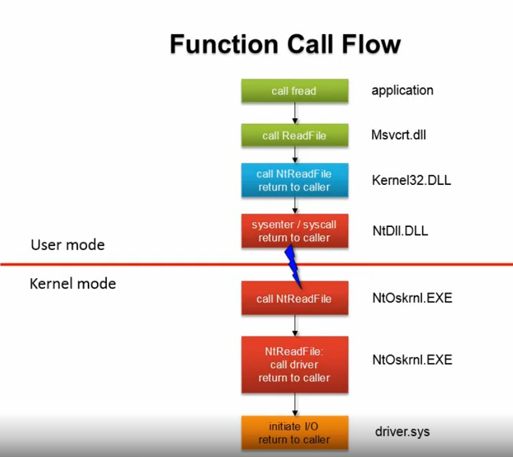
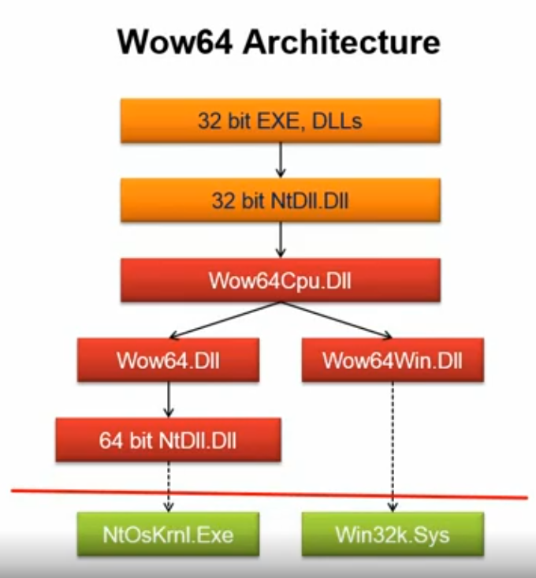
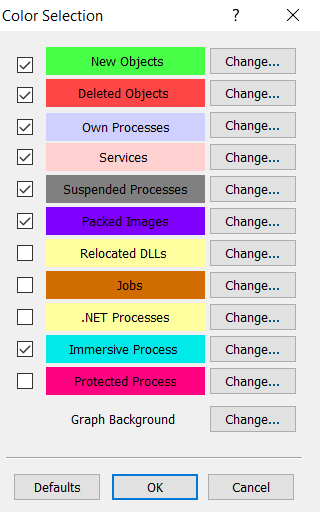
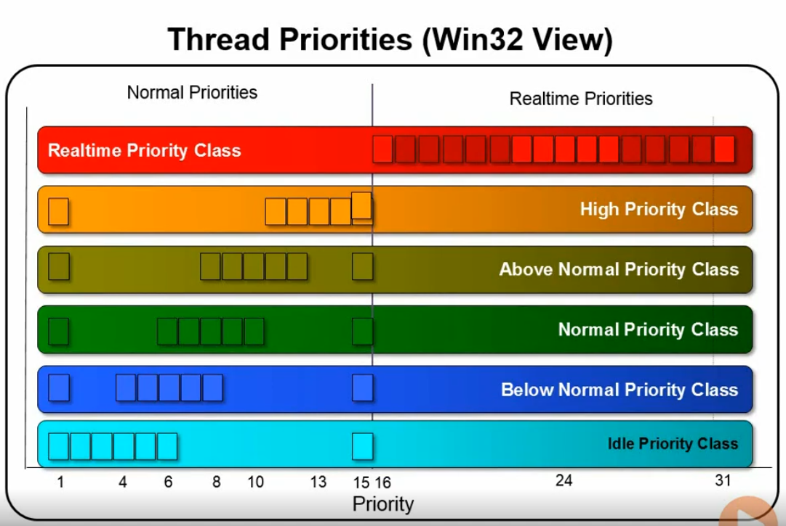
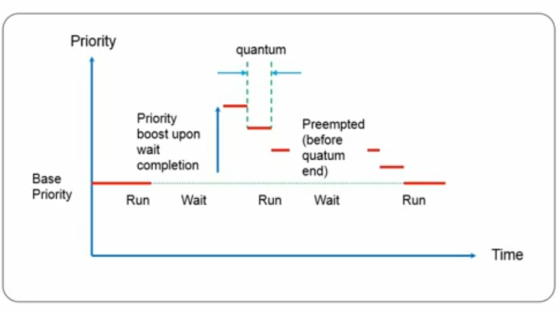
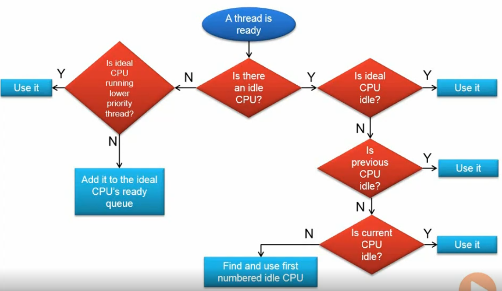
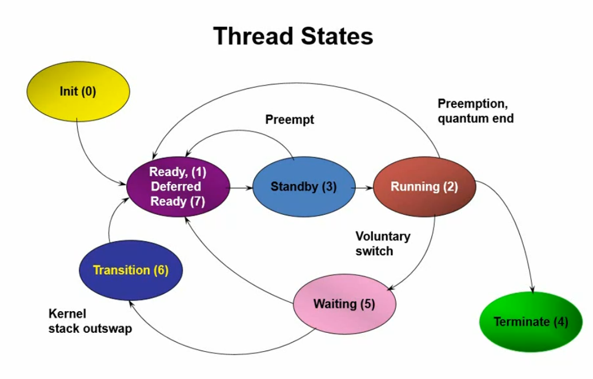

Windows Internals I
-------------------

**Tools:** Task Manager, Resource Editor, Performance Monitor, [Sysinternals](https://docs.microsoft.com/en-us/sysinternals/downloads/), [Windows SDK](https://developer.microsoft.com/en-us/windows/downloads/windows-10-sdk/).

**Basic Concepts:**  
- User-Mode:  
1- Allows access to non-operating system code & data only.  
2- No access to the hardware.  
3- Protects the system from crashing.

- Kernel-Mode:  
1- Privileged mode to be used by the kernel and device drivers only.  
2- Allows access to all system resources.  
3- Can potentially crash the system.

**Process:** Set of resources which are used to execute a program. (containers of data structures).  
- It consists of:  
1- Private virtual address.  
2- Executable program referring to an image on disk containing the initial code and data to be executed.  
3- Table of handles to various objects.  
4- Security context (access token) which is used for security checks during accessing shared resources.  
5- One or more threads that execute code.

**Thread:** Entity that is scheduled by the kernel to execute code.  
- It consists of:  
1- State of CPU registers.    
2- Current access mode (user or kernel).    
3- Two stacks, one in user space and one in kernel space.    
4- Private storage area (It’s called Thread Local Storage, TLS).    
5- Optional security token.  
6- Optional message queue and windows that thread created.  
7- Priority (0 to 31) which is used in thread scheduling.    
8- State (Running, Ready, Waiting).

**Virtual Memory:** It’s a memory management technique that provides an idealized abstraction of the storage resources that are actually available on a given machine.  
- It provides per process a private address space isolated from other processes.  
- Each process sees a flat linear memory.  
- Internally, virtual memory may be mapped to physical memory or stored on disk.  
- Processes access memory regardless of where it actually resides.  
- The memory manager handles mapping of virtual to physical pages.

**Objects and Handles:** They’re used to regulate access to the system resources.  
- The usage of objects ensures that Microsoft can update system functionality, as long as the original object interface is maintained. When subsequent versions of the system are released, you can use the updated object with little or no additional work.  
- The usage of objects enables you to take advantage of Windows security; Each object has its own access-control list (ACL) that specifies the actions a process can perform on the object. The system examines an object's ACL each time an application creates a handle to the object.

**Notes:**  
- Objects are runtime instances of static structure (Process, Mutex, Event, etc).  
- They reside in the system memory space (can only be accessed by kernel code).  
- The handles represent all open objects a specific process has access to.  
- User mode can only get the handle of an object.  
- The object manager is the entity responsible for creating, obtaining and manipulating objects.  
- Kernel objects are accessed from user-mode using private process handles.  
- Running means that the thread owning that window is ready to receive user input.

**System Architecture:**

- NTDLL.DLL: The lowest layer in user mode which does the transition from user to kernel.  
- Executive: Upper layer in kernel mode. It doesn’t provide actual implementation and it doesn’t care about user interface.  
- Device Drivers: It operates or controls a particular type of device that is attached to a computer.  
- HAL: It allows the operating system to interact with the hardware device at an abstract level.  
- Environment Subsystem: It manages a particular subsystem.  
- System Processes: such as crss.exe and various services; They are always running.

**Brief Overview of WinDbg:**  
- WinDbg is part of the debugging tools for windows.  
- Other debuggers in the tools: NTSD, CDB, KD.  
- All debuggers are based on the same engine (DbgEng.dll).  
- NTSD & CDB are user mode debuggers.  
- KD is a kernel mode debugger. It lets us look at any memory.  
- WinDbg can serve as a user mode or kernel mode debugger.  
- WinDbg is the only one with GUI.  
- You can’t set a pointer while debugging a local kernel.

**Core System Files:**  
- Ntoskrnl.exe: Executive and kernel on 64-bit systems.  
- NtkrnlPa.exe: Executive and kernel on 32-bit systems.  
- Hal.dll: Hardware abstraction layer.  
- Win32k.sys: Kernel component of the Windows subsystem and it handles windowing and GDI.  
- NtDll.dll: System support routines and Native API dispatcher to executive services.  
- Kernel32.dll, user32.dll, gdi32.dll, advapi32.dll: Core Windows subsystem DLLs.  
- CSRSS.exe: Client Server Runtime SubSystem.

**Symmetric Multiprocessing:**  
- All CPUs are the same and share main memory and have equal access to peripheral devices.  
- Basic architecture supports up to 32/64 CPUs.  
- Actual number of CPUs determined by licensing and product type.

**Subsystem:**  
- It’s a special view of the operating system.  
- It must always be running (owner of keyboard, mouse and display).  
- Some APIs functions use the Advanced Local Procedure Call (ALPC) to notify CSRSS of relevant events.  
- Other subsystems configured to load on demand.  
- Subsystem information stored in registry: HKLM\System\CCS\Control\SessionManager\Subsystems.  
- Every image belongs to exactly one subsystem (which allows the Windows Loader to make correct decisions).  
- An image of a certain subsystems calls API functions exposed through the subsystem DLLs.  
- Native images belong to no subsystem.

**The Native API:**  
- It’s implemented by NTDLL.dll (which is used by subsystem DLLs and native images).  
- It contains various support function and a dispatcher to kernel services.  

**System Processes:**  
- Idle process:  
1- It has a PID of 0.  
2- It doesn’t run an executable image.  
3- It accounts for idle time.  
- System process:  
1- It has a PID of 4.  
2- It represents the kernel address space and resources.  
3- It hosts system threads created by the kernel and device drivers.  
- Session Manager (Smss.exe):  
1- It’s running the image \windows\system32\smss.exe.  
2- The first user mode process created by the system.  
3- It creates the system environment variables.  
4- It launches the subsystem processes (normally just csrss.exe).  
5- It launches itself in other sessions.  
6- It waits for subsystem creation request.  
7- It waits for the terminal services session creation requests.  
- Windows subsystem (Csrss.exe): If any of its instances died the system would crash.   
- Logon process (Winlogon.exe):  
1- It’s running the image \windows\system32\winlogon.exe.  
2- It handles interactive logons and logoffs.  
3- If it’s terminated the user session would log off.  
4- It’s notified of a user request by the Secure Attention Sequence.  
5- It authenticates the user by presenting a username/password dialogue through LogonUI.exe.  
6- It sends entered username and password to Lsass.exe to authenticate and initiate the session.  
- Service Control Manager, SCM (Services.exe):  
1- It’s running the image \windows\system32\services.exe.  
2- It’s responsible for starting, stopping and interacting with service processes.  
- Local security authentication server (Lsass.exe):  
1- It’s running the image \windows\system32\Lsass.exe, It calls the appropriate authentication package.  
2- It creates a token representing the user security profiles upon successful authentication.  
3- It returns the information to Winlogon.  
- Local session manager (Lsm.exe):  
1- It’s running the image \windows\system32\lsm.dll.  
2- It manages terminal sessions on the local machine.

**WoW64 Architecture:** 

- It allows execution of Win32 binaries on 64-bit Windows: It intercepts system calls from the 32-bit application then it issues the native 64-bit system call then it returns any data from the 64-bit system call.  
- The IsWow64Process function can tell whether a process is running under Wow64.  
- Address space is 2GB or 4GB (if image is linked with the LARGEADDRESSAWARE flag.  
- Device drivers must be native 64-bit.  
- A 64-bit process can’t load a 32-bit DLL and vice versa (Except resource-only DLLs).  
- Some APIs aren’t supported by Wow64 process (such as ReadFileScatter and AWE functions).  

**Process:**  
- It’s a management and containment object.  
- Processes don’t run.. Threads do.  
- It owns:  
1- Private virtual address (2GB/3GB on 32 bit, 8TB on 64 bit).  
2- Working set (physical memory owned by process).  
3- Private handle table to kernel objects.  
4- Access token (It determines the security context in which the code executes in that process).
- It has a priority class (from Win32) which affects all threads running that process.  
- Basic creation function: CreateProcess, CreateProcessAsUser.  
- It’s terminated when: All threads in the process terminate, One of the threads calls ExitProcess (Win32), Killed with TerminateProcess (Win32).

**Flow of Process Creation:**  
- Open image file.
- Create kernel Executive Process object.
- Create initial thread.
- Create kernel Executive Thread object.
- Notify CSRSS of new process and thread.
- Complete process and thread initialization: Load required DLLs and initialize, DllMain function called with DLL_PROCESS_ATTACH.
- Start execution of main entry point (main/WinMain).

**Processes colors in procexp:**

**Thread:**  
- It’s an instance of a function executing code.  
- It manages and provides all necessary resources for the code to be executed.  
- It owns: Context (registers, etc) and 2 stacks (user mode and kernel mode), Optional message queue, Optional security token.  
- Scheduling State: Priority (0 to 31), State (Ready, Waiting, Running), Current access mode (user or kernel).  
- Basic creation function: CreateThread (Win32).  
- Destroyed when: Thread function returns (Win32), The thread calls ExitThread (Win32), Terminated with TerminateThread (Win32).

**Thread Stack:** It's the usual place where local variables are kept.  
- Every user mode thread has two stacks:  
1- In kernel space 12KB for x86 and 24KB for x64. (so that user code don’t interfere with kernel).  
2- In user space 1MB is reserved, 64KB committed. (readily available and mapped into memory).  

**Thread Priorities:**  
- Priority 0 is reserved for the zero page thread. (1 and 15 are saturation values)  
- The Windows API mandates thread priority is based on a process priority class (base priority).  
- A thread’s priority can be changed around the base priority.  
- APIs (Win32):  
1- SetPriorityClass: It changes process base priority.  
2- SetThreadPriority: It changes the thread priority offset from the parent’s base priority.  
- API (kernel):  
1- KeSetPriorityThread: It changes thread priority to some absolute value.  

**Thread Scheduling (single processor):**  
- Priority based, preemptive, time sliced.  
1- Highest priority thread runs first.  
2- If time slice (quantum) elapses, and there’s another thread with the same priority in the ready state.. it runs. Otherwise the same thread runs again.  
3- If thread A runs and thread B (with higher priority) receives something it waited upon (message, kernel object signaling, etc), thread A is preempted and thread B becomes the running thread.  
- Typical time slice is 30 msec on client and 180 msec on server.  
- On an MP system with N logical processors, N concurrent threads may be running.  

**The Scheduler:**  
- Scheduling routines are called when scheduling events occur.  
1- Interval Timer interrupts checks for quantum end and timed wait completetion.  
2- I/O completion calls.  
3- Changes in thread priority.  
4- Changing state of waitable object other threads are waiting on.  
5- Entering a wait on one or more objects.  
6- Entering sleep.

**Priority Boosts:**  
- Windows boosts the priority of threads in a number of scenarios:  
1- Completion of I/O operations.  
2- After waiting for events or semaphores.  
3- During waiting for an executive resource.  
4- After threads in the foreground process complete a wait operation.  
5- When GUI threads wake up because of windowing activity.  
6- When a thread is starved.  
- Thread priorities in the real time range don’t receive any boost.

**Thread Priority Boost and Decay:**

**Multiprocessing:**  
- Ideal Processor:  
1- Every thread has an ideal processor.  
2- Default value set in round-robin within each process.  
3- Can override SetThreadIdealProcessor.  
4- On hyper-threaded systems, the next ideal processor selected is from the next physical core.  
- Threads can run on any CPU unless hard affinity is set for that thread.

**Multiprocessor Scheduling:**  
- Single CPU is relatively simple. (It uses the highest priority thread).
- Multi CPU systems complicate things.  
1- Windows attempt to balance priority needs with thread’s preferred and previous CPUs.  
2- The only guarantee is that one of the highest priority threads is running on some CPU.  
- Non uniform memory architecture, NUMA complicates things further.

**Thread Synchronization:**  
- Threads sometimes need to coordinate work.  
- Synchronization is based upon waiting for some condition to occur.  
- The kernel provides a set of synchronization on which threads can wait efficiently.

**Kernel Dispatcher Objects:**  
- Maintain a state (signaled or non-signaled which depends on the object type).  
- Can be waited to change to the signaled state:  
1- Windows API: WaitForSingleObject, WaitForMultipleObjects and their variants.  
2- Kernel mode: KeWaitForSingleObject, KeWaitForMultipleObjects.  
- High level wrappers exist:  
1- MFC: CsyncObject (abstract base of CMutex, CSemaphore and others).  
2- .NET: WaitHande (abstract base of Mutex, Semaphore and others).

**Signaled meaning:**  
- Process: It’s terminated.  
- Thread: It’s terminated.  
- Mutex: It’s free.  
- Event: Its flag is raised.  
- Semaphore: Its count is greater than zero.  
- File, I/O completion port: I/O operation is completed.  
- Timer: Interval time expired.

**Kernel Object Types:**  
- Mutex:  
1- Mutual exclusion.  
2- Called Mutant in kernel terminology.  
3- It allows a single thread to enter a critical region.  
4- The thread enters the critical region is the owner of this mutex.  
5- Releasing the mutex allows one thread to acquire it and enter the critical section.  
6- Recursive acquisition is ok (increments a counter).  
7- If the owning thread doesn’t release the mutex before it terminates, the kernel releases it and the next wait succeeds with a special code (abandoned mutex).  
- Semaphore:  
1- It maintains a counter (set at creation time).  
2- It allows N callers to go through a gate.  
3- When a thread succeeds a wait, the semaphore counter decreases (when the counter reaches zero, subsequent waits don’t succeed. Releasing the semaphore increments its counter, releasing that thread is waiting).  
4- It doesn’t maintain any ownership.  
- Event:  
1- It maintains a Boolean flag.  
2- Its types: Manual reset (notification in kernel terms) of Auto reset (Sync).  
3- Manual reset event releases any number of threads.  
4- Auto reset event releases only one thread and the event go automatically to non-signaled state.  
5- It provides flow synchronization as opposed to data synchronization.  
- Critical Section:    
1- It’s the user mode replacement for a mutex.  
2- It can be used to synchronize threads within a single process.  
3- Cheaper than a mutex when no contention exists (no transition to kernel mode in this case).  
4- It uses EnterCriticalSection and LeaveCriticalSection API functions.  
5- No way to specify a timeout other than infinite and zero.  
- Jobs:  
1- It’s a kernel object that allows managing one or more processes as a unit.  
2- System enforces Job quotes and security (total and per process CPU time, working sets, CPU affinity, priority class, quantum length, security limits and UI limits).  
3- APIs: CreateJobObject/OpenJobObject, AssignProcessToJobObject, TerminateJobObject.

Download from [here](https://drive.google.com/file/d/17AkUt8G0xqwz8xM763Iy1HR026CO9UK3/view?usp=sharing).  
ادعولي :)
---------

Disclaimer: I don't own the previous content.. They are just my studying notes.  
All rights reserved to Pavel Yosifovich and Pluralsight.

