Windows Internals II
-------------------

***Object Management***

**Object Manager**  
- It’s a part of the executive.  
- It manages creating, deleting and tracking objects.  
- It maintains objects in a tree-like structure (can be partially viewed with WinObj tool).  
- User mode clients can obtain handles to objects (but can’t touch actual memory structure).  
- Kernel mode clients can use both handles and objects themselves.

**Object Types Exposed by the Windows API**  
- Process (CreateProcess, OpenProcess).  
- Thread (CreateThread, OpenThread).  
- Job (CreateJobObject, OpenJobObject).  
- File Mapping (CreateFileMapping, OpenFileMapping).  
- File (Create File).  
- Token (LogonUser, GetProcessToken).  
- Mutex or Mutant (CreateMutex, OpenMutex).  
- Event (CreateEvent, OpenEvent).  
- Semaphore (CreateSemaphore, OpenSemaphore).  
- Timer (CreateWaitableTimer, OpenWaitableTimer).  
- I/O Completion Port (CreateIoCompletionPort).  
- Window Station (CreateWindowStation, OpenWindowStation).  
- Desktop (CreateDesktop, OpenDesktop).

**Object Structure**

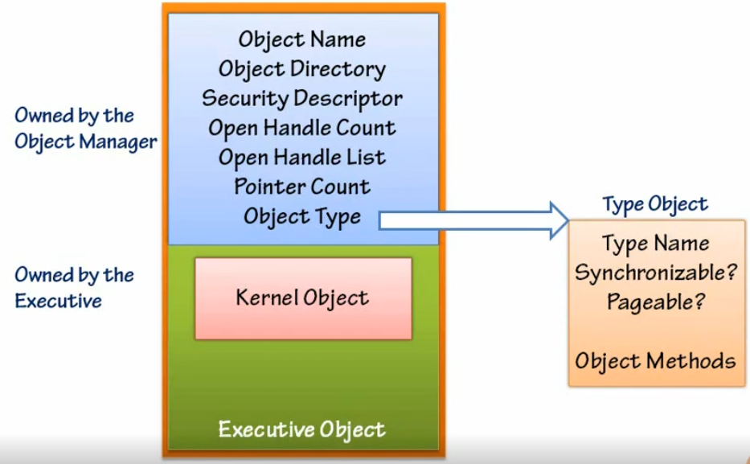

**Object and Handles**  
- When a process creates or opens an object, it receives a handle to that object.  
1- A handle is just a number and it serves as an index to a table maintained by EPROCESS.  
2- Used as an opaque, indirect pointer to the underlying object.  
3- It allows sharing objects across processes.  
- In .NET, handles are used internally by types such as FileStream, Mutex, Semaphore, etc.  
- Each Process has a private handle table and it can’t be shared with other processes.  
- Viewing process handles:  
1- Process Explorer (GUI) or handle.exe (Console).  
2- Resource Monitor.  
3- !handle debugger command.

**Handle Usage**  
- User mode processes retrieve a handle by calling CreateFunction or OpenFunction.  
- Each object must have a unique name or GetLastError() returns ERROR_ALREADY_EXISTS.  
- Kernel code can obtain handles that reside in system space. It can also obtain a direct pointer to underlying object given a handle by calling ObReferenceObjectbyHandle.  
- When a process terminates for whatever reason all handles will be closed by the terminal.

**Sharing Objects**  
- A handle is private to its containing process.  
- Sharing is possible through:  
1- Process handle inheritance (some handles are copied into the newly created process).  
2- Opening an object by name (dangerous because names are global and can be changed).  
3- Duplicating a handle.

**Handle Entry Layout**

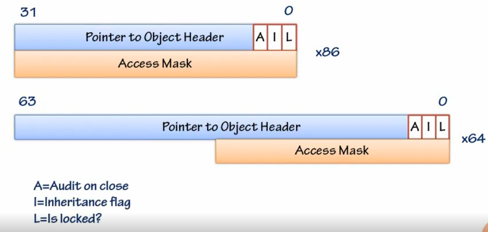

**Object Names and Sessions**  
- Each session should have its own objects.  
- The object manager creates a Sessions directory with a session ID subdirectory.  
- Processes can access the global session objects by prefixing object names with “Global\”.  
- CreatePrivateNamespace function is used for tightened security.

**User and GDI Objects**  
- The Object Manager is responsible for kernel objects only.  
- User and GDI objects are managed by Win32k.sys.  
- The API functions in user32.dll and gdi32.dll don’t go through NtDll.dll (because Ntdll.dll is related directly to the kernel such as handling memory, processes, synchronization, threads, security, etc).  
- user32.dll and gdi32.dll invoke the sysenter/syscall instructions directly.  
- User objects: Windows (HWND), menus (HMENU) and hooks (HHOOK).  
- User objects handles: No reference/handle counting and private to a Window Station.  
- GDI objects: Device context (HDC), pen (HPEN), brush (HBRUSH), bitmap (HBITMAP), etc.  
- GDI object handles: No reference/handle counting and private to a process.

**Object Management Summary**  
- Objects are structured entities managed by the Object Manager.  
- Objects are reference counted.  
- Objects can be shared between processes.  
- User mode clients work with handles.

***Memory Management***

**Memory Manager Fundamentals**  
Each process sees a virtual address space (2GB for 32-bit and 8TB for 64-bit).  
- Memory Manager tasks:  
1- Mapping virtual addresses to physical addresses.  
2- Using page files to back up pages that cannot fit in the physical memory.  
3- Provide memory management services to other system components.  
- Memory is managed by Pages.   
- Page size is determined by CPU type.  
- Allocations, de-allocations and other memory block attributes are always per page.

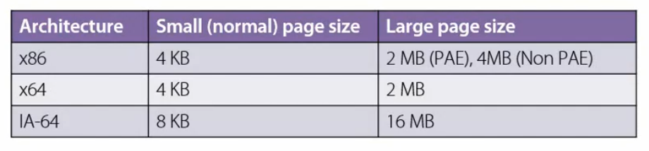

**Virtual Page States**  
- Free: Unallocated page. Any access causes violation exception.  
- Committed: Allocated page that can be accessed. It may have a backup on disk.  
- Reserved: Unallocated pages causing violation on access. Address range won’t be for future allocations unless specifically requested.  
- They can be viewed using VMMap tool from Sysinternals.

**Sharing Pages**  

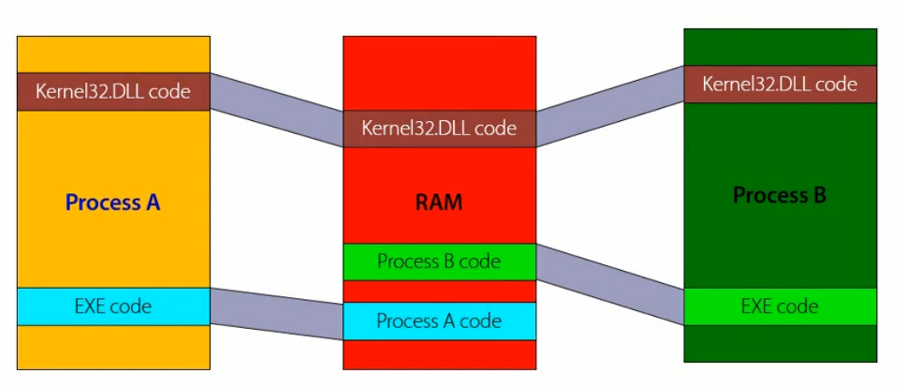

- Code pages are shared between processes.  
1- Two or more processes based on the same image.  
2- DLL code (however, DLLs must be loaded in the same address).  
- Data pages (read/write) are shared at first.  
1- They are shared with special protection called Copy-On-Write.  
2- If one process changes the data, an exception is caught by the Memory Manager, which creates a private copy of the accessed page for that process (removing the protection).  
3- No other process would see this change.  
- Data pages can be created without Copy-On-Write.

**Page Directory**  
- It’s one per process and physical address of page directory stored in KPROCESS structure.  
- While a thread is executing, the CR3 register stores its address.  
- When a thread context switch occurs between threads of different processes, CR3 is reloaded from the appropriate KPROCESS instance.

**Virtual Address Space Layout**  
- Each process sees its own private address space.  
- System Space is part of the entire address space visible but not accessible by user-mode.  
- The layout depends on the “bitness” of the OS and the specific process.

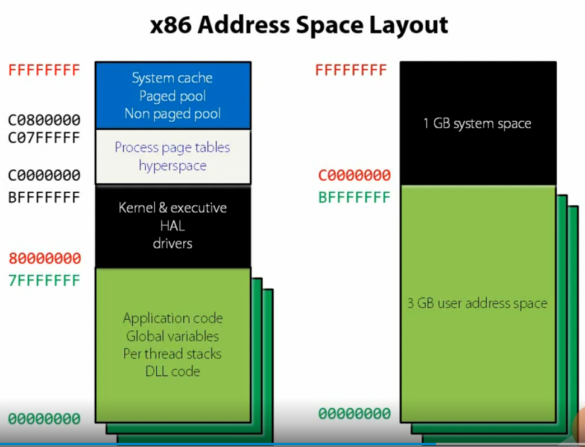  
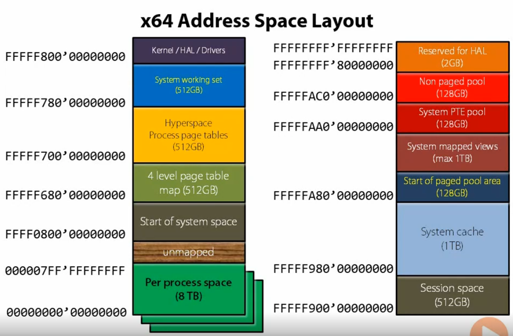

**x64 Address Limitations**  
- 64 bits of addresses can reach to 2^64 = 16EB which is unimaginable amount of memory.  
- Current CPU architectures only support 48 bits addressing.  
- Current kernel implementations can work with 16TB at most.  

**Virtual Address Translation**  

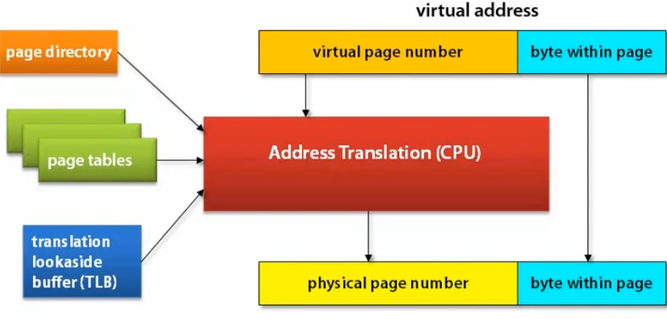  
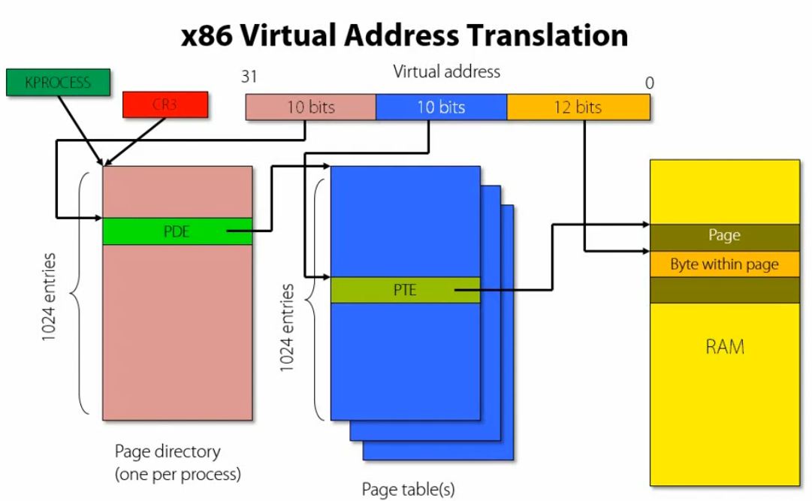

 **x86 PDE and PTE**  
- Each entry is 32 bits (64 bits on PAE).  
- Upper 20 bits is the Page Frame Number (PFN).  
- Bit 0 is the Valid bit (If set, it indicates that page is in RAM. Otherwise, accessing the page causes a page fault).

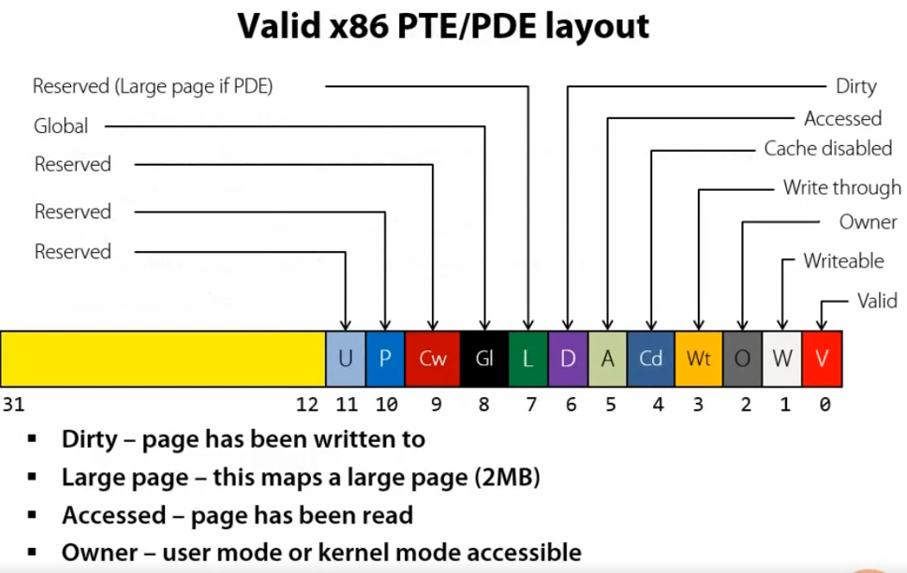

**Physical Address Extensions, PAE**  
- Intel Pentium Pro and later processors support a new PAE mode.  
- Virtual address translation contains an extra level of indirection.  
- Each PTE/PDE is 64 bits, of which 24 are the PFN.  
- Default 32-bit kernel is the PAE kernel.

**x64 Virtual Address Translation**  
- The idea is the same but with more tables and indirections.

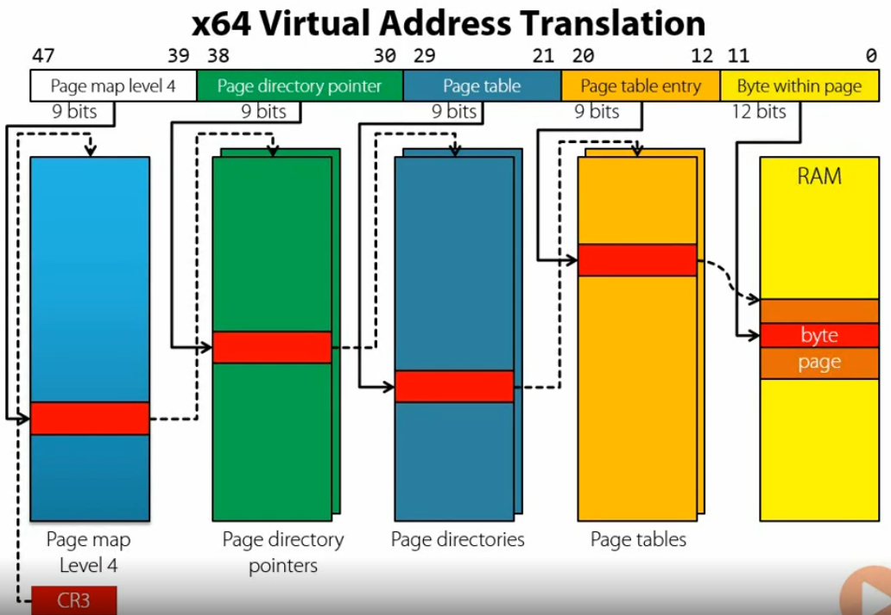

**Page Faults**  
- Valid PTE/PDE results in the CPU accessing data in physical memory.  
- If PTE/PDE is invalid, the CPU throws a page fault exception.  
- Windows has to get the data from disk, fix the required PTE/PDE and let the CPU try again.  
- Page fault types:  
1- Hard page fault – requires disk access.  
2- Soft page fault – does not require disk access.  
3- Example: a needed shared DLL is simply directed to the process by pointing PTE to it.

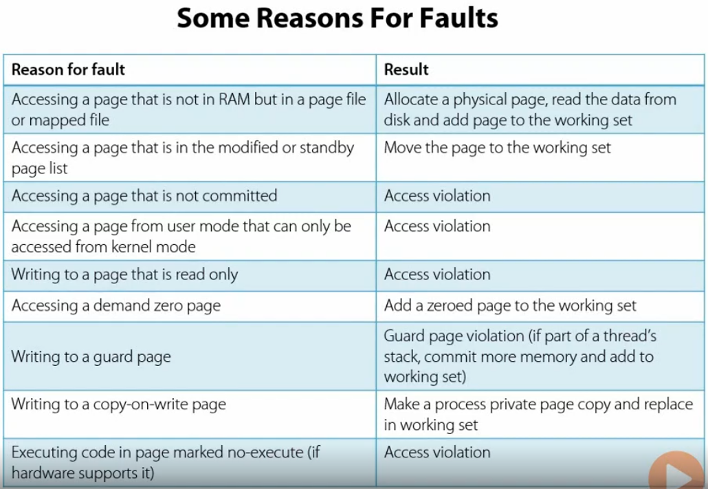

**Invalid PTEs**  
- The CPU throws a page fault exception when the Valid bit in a PTE is clear.  
- Windows uses the other PTE bits to indicate where the required page can be found.  
- Example: a page that resides in a page file (x86 w/o PAE).
 
 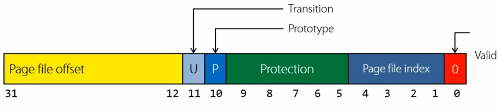
 
**Page Files**  
- Backup Storage for writeable, non-shareable committed memory:  
1- Up to 16 page files are supported.  
2- Initial size and maximum size can be set.  
3- Named PageFile.Sys on disk (root partition).  
4- Created contagious on boot.  
5- Initial value should be maximum of normal usage.  
- Page files information in the registry.  
1- HKLM\SYSTEM\CurrentControlSet\Control\Session Manager\ Memory Management\ PagingFiles  
- Page file maximum size is 4GB for x86 original kernel and 16TB for x64.

**Commit Charge**  
- It represents the memory that can be committed in RAM and existing page files.  
- Contributors to the commit charge:  
1- Private committed memory (VirtualAlloc with MEM_COMMIT flag).  
2- No RAM or page file is used until memory is actually touched until then considered demand zero pages.  
3- Page file backed memory mapped file allocated with MapViewOfFile.  
4- Copy on write mapped memory.  
5- Kernel non-paged and paged pools.  
6- Kernel mode stacks.  
7- Page tables and yet-to-be-created page tables.  
8- Allocations with Address Windowing Extensions (AWE) functions.  
- The Commit limit is basically the amount of RAM + maximum size of all page files.  
- If a page file grows, the committed limit can grow with it.

**Working Sets:** the amount of physical memory used by some entity.  
 - Process Working Set: The subset of the process committed memory residing in physical memory.  
 - System Working Set: The subset of system memory residing in physical memory.  
 - Systems with terminal services.  
 - Demand paging (when a page is needed from disk, more than one is read at a time to reduce I/O.
 
 **Page Frame Number Database**  
- It describes the state of all physical pages.  
- Valid PTEs point to entries in the PFN database.  
- A PFN entry points back to the PTE.  
- The structure layout of a PFN entry depends on the state of the page.  
- Kernel debugger: !memusage, !pfn.

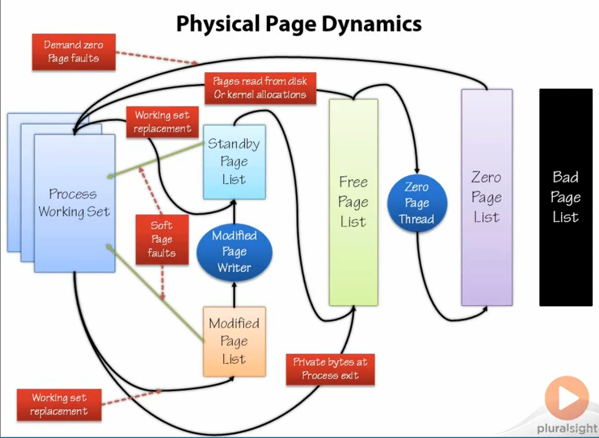

**Memory APIs in User Mode**  
- Virtual API: VirtualAlloc, VirtualFree, VirtualProtect, etc.  
- Lowest level API:  
1- Works on page granularity only.  
2-  Allows reserving and/or committing of memory.  
3- Good for large allocations.  
- Heap API:  
1- HeapCreate, HeapAlloc, HeapFree, etc.  
2- Uses the Virtual API internally.  
3- Manages small allocations without wasting pages.  
- C/C++ runtime:  
1- malloc, realloc, free, operator new, etc.  
2- Uses the heap API (usually – compiler independent).  
- Local/Global API:  
1- LocalAlloc, GlobalAlloc, GlobalLock, LocalFree, etc.  
2- Mostly for compatibility with Win16.

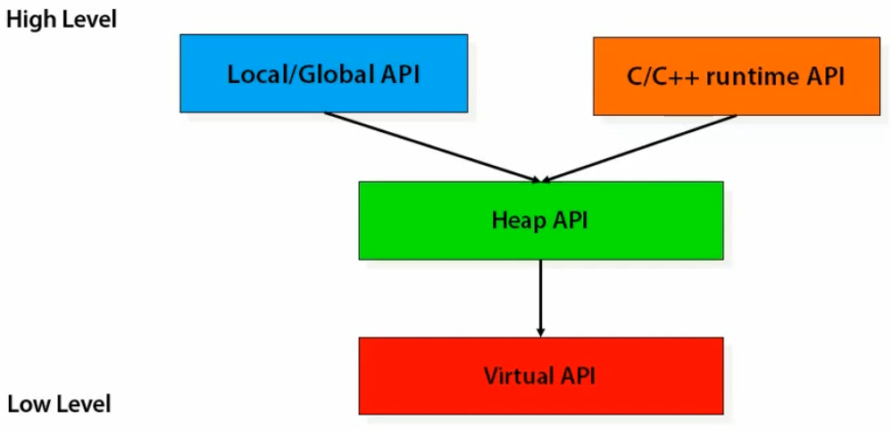

**The Heap Manager**  
- Allocating in page granularity is sometimes too much (It needs fine grained control).  
- It manages smaller allocations (8 bytes minimum).  
- The HeapXxx Windows API functions are a thin wrapper over the native NtDll.Dll functions.  

 **Heap Types**  
- One heap is always created with a process, called the Default Process Heap and it can be accessed using GetProcessHeap.  
- Additional Heaps can be created using the HeapCreate function.  
- A heap can be fixed in size or grownabe (the default is grownable).  
- Low Fragmentation Heap, LFH.

**System Memory Pools**  
- Kernel provides two general memory pools for using by the kernel itself and device drivers.  
1- Non-paged pool  
2- Memory always resides in RAM and never paged out.  
3- Can be access at any IRQL.  
- Paged pool  
1- Memory can be swapped to disk.  
2- Should be accessed at IRQL < DPC_LEVEL (2) only.  
- Pool sizes depend on the amount of RAM and the OS type.  
1- Can be altered up to some maxima in the registry (HKLM\System\CurrentControlSet\Control\Session Manager\Executive).  
- Task Manager displays current sizes.  
- APIs  
1- ExAllocatePool: Allocate memory from the paged or non-paged pool.  
2- ExAlocatePoolWithTag: allocate memory at tag with it a 4-byte value and can be used to track memory leaks.  
3- ExFreePool: Frees memory previously allocated on whatever pool.  
- Pool usage and tags can be viewed with PoolMon.Exe (It’s a part of Windows Driver Kit).  
- Known pool tags can be found with the debugging tools for Windows (triage subfolder).

**Memory Mapped Files**  
- Internally called Section objects.  
- Allow the creation of views into a file (return a memory pointer for data manipulation).  
- Imply shared memory capabilities (usual case with mapping EXEs and DLLs).  
- Can create pure shared memory.  
1- Backed up by page files.  
2- When memory mapped file object destroyed, memory is recycled.  
- Win32 APIs:  
1- CreateFileMapping: Creates a file mapping object based on a specific file which was previously created with CreateFile or based on system paging file.  
2- OpenFileMapping: Opens an existing MMF based on its name NOT the filename.  
3- MapViewOfFileEx: Creates a view into the MMF.  
- .NET APIs:  
1- System.IO.MemoryMappedFiles.  
2- Classes: MemoryMappedFile, MemoryMappedViewStream and MemoryMappedViewAccessor.  
- Kernel APIs:  
1- ZwCreateSection: Creates a section object.  
2- ZwCreateFile.  
3- ZwMapViewOfSection: Maps a view into the system space.

**Large Pages**  
- Large pages allow mapping using a PDE only (no need for PTEs).  
1- Advantage: Better use of the translation look aside buffers.  
- Windows maps by default large pages for NtOsKrnl.Exe and Hal.Dll as well as core system data (initial non-paged pool and PFN database).  
- Potential disadvantages:  
1- Single protection to entire page.  
2- May be more difficult to find a large page size contagious physical memory for mapping.  
- Programmatically using large pages.  
1- Specifying the MEM_LARGE_PAGE in calls to VirtualAlloc function.  
2- Size and alignment must be of large page size ( Can be determined by calling the GetLargePageMinimum function).

**Trap Dispatching**
- Kernel mechanisms for capturing an execution thread’s state when an interrupt or exception occurs and transferring control to a handling routine.  
- Traps: Interrupts or exceptions. Divert code execution outside the normal flow.  
- Interrupt: Asynchronous event, unrelated to the current executing code.  
- Exception: Synchronous call to certain instructions. Reproducible under same conditions.

**Hardware Interrupts**

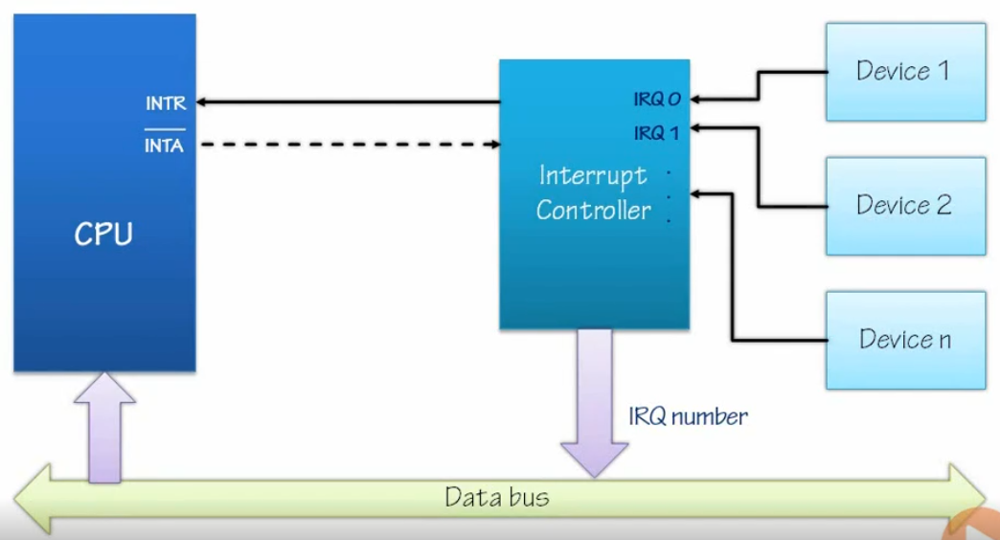

**Interrupt Dispatching**

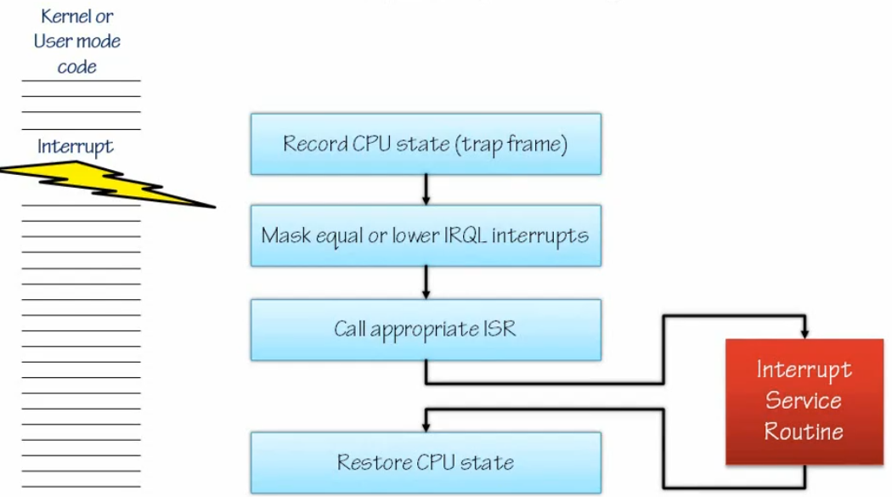

**Interrupt Request Level, IRQL**  
- Each interrupt has an associated IRQL.  
1- It can be considered its priority.  
2- Hardware interrupts are mapped by the HAL.   
- Each processor’s context includes its current IRQL (CPUs always run the highest IRQL code).  
- Servicing an interrupt raises the processor IRQL to the level of the interrupt’s IRQL.  
- Dismissing an interrupt restores the processor’s IRQL to that prior to the interrupt.  

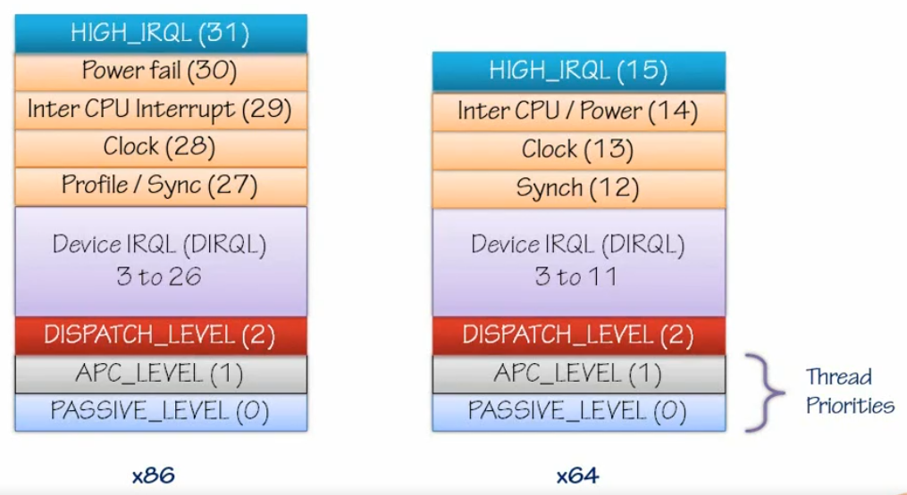
 
- PASSIVE_LEVEL (0)  
1- The normal IRQL level.  
2- User mode code always runs at this level as well as most kernel code.  
- APC_LEVEL (1)  
1- Used for special kernel APCs.  
- DISPATCH_LEVEL or DPC_LEVEL (2)  
1- The kernel scheduler runs at this level.  
2- If the CPU runs code at this or higher level, no context switching will occur on that CPU until IRQL drops below this level.  
3- No waiting on kernel objects as it requires scheduler.  
- Page faults can only be handled in IRQL < DISPATCH_LEVEL  
1- Code running at this or higher IRQL must always access non-paged memory.  
- Device IRQL, DIRQL  
1- Used for hardware devices.  
2- The level that an ISR runs at.  
3- Always greater than DISPATCH_LEVEL (2).  
- HIGH_LEVEL (x86 = 31, x64 = 15)  
1- The highest level possible.  
2- If code runs at this level, nothing can interfere on that CPU.  
3- However, other CPUs aren’t affected.  
- Other levels exist for kernel internal usage.

**IRQL vs. Thread Priorities**  
- IRQL is an attribute of a CPU.  
- Thread priority is an attribute of a thread.  
- With IRQL >= DISPATCH_LEVEL (2)  
1- Thread priorities has no meaning.  
2- The currently executing thread will execute forever until IRQL drops below 2.  
- IRQLs can be changed in kernel mode only using KeRaiseIrql and KeLowerIrql.

**The Spin Lock**  
- Synchronization on MP systems uses IRQLs within each CPU and spin locks to coordinate among the CPUs.  
- A spin lock is just a data cell in memory.  
1- It is accessed with a test and modifies operation, atomic across all processors.  
2- Similar in concept to a mutex.    
- Mutex synchronizes threads, Spin Locks synchronize processors.  
- Not exposed and not need to user mode applications.

**Acquiring a Spin Lock**

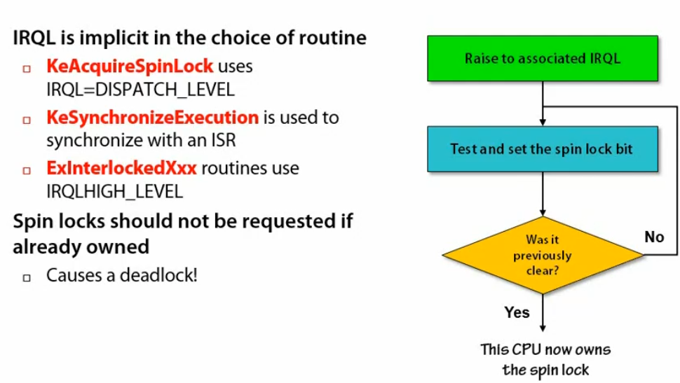

**Exceptions**
- Synchronous event resulting from certain code (dividing by zero, access violation, stack overflow, invalid instructions, others).   
- Structured Exception Handling: Mechanism used to handle and possibly resolve exceptions.  
- Exceptions are connected to entries in the IDT.

**Exceptions Handling**  
- Some exceptions are handled transparently and some are filtered back to user for handling.  
- Frame based exception handlers are searched (32-bit systems).  
1- If the current frame has no handlers, the previous frame is searched and so on.  
2- 64 bit systems don’t use frames but search mechanism is the same.  
- Unhandled exceptions from kernel mode generate a bug check (Blue Screen of Death).

**Structured Exception Handling, SEH**  
- Exposed for developers by extended C keywords:  
1- __try: Wraps a block of code that may throw exceptions.  
2- __except: Possible block for handling exceptions in the preceding __try block.  
3- __finally: Executes code whether an exception occurred or not.  
4- __leave: Jumps to the __finally clause.  
- Allowed blocks are __try/__finally and __try/__except. However, can be nested to any level.  
- Works in kernel mode and user mode.  
- Custom exceptions can be raised with RaiseException (Win32).

**System Crash**  
- Blue Screen of Death.  
- Occurs when an exception in kernel mode was unhandleded.  
- Stops everything (code executing in kernel mode is supposed to be trusted).  
- If the system crashes it can write crash dump information to a file and be analyzed with dbg.  

**Resolving Exceptions:**

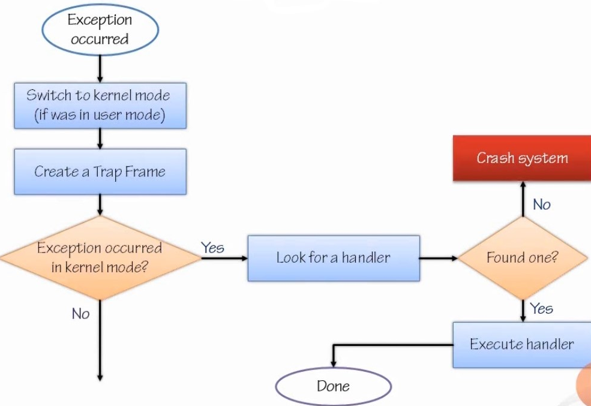  
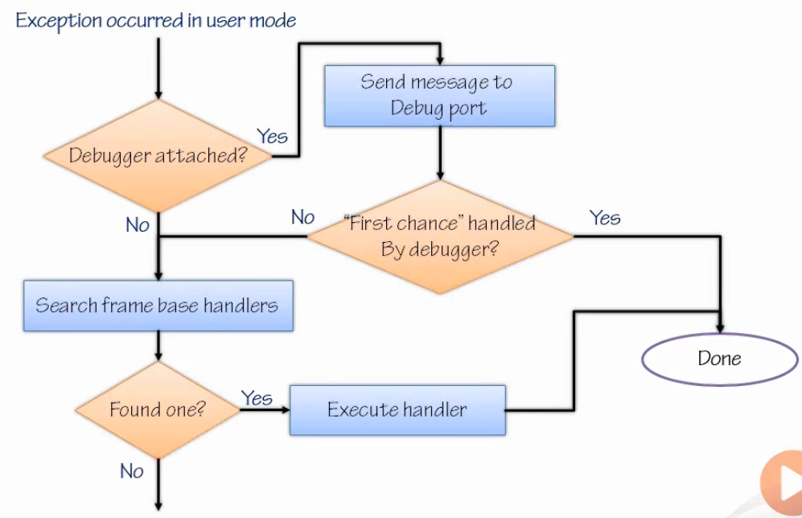  
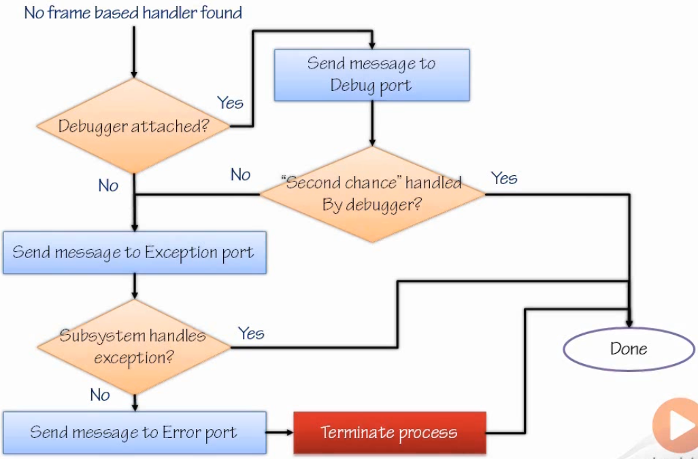

Download from [here](https://drive.google.com/file/d/1JHqrrGnPzn6q8NfplMhTtNJ3htyr_J8h/view?usp=sharing).  
ادعولي :)
---------

Disclaimer: I don't own the previous content.. They are just my studying notes.  
All rights reserved to Pavel Yosifovich and Pluralsight.

