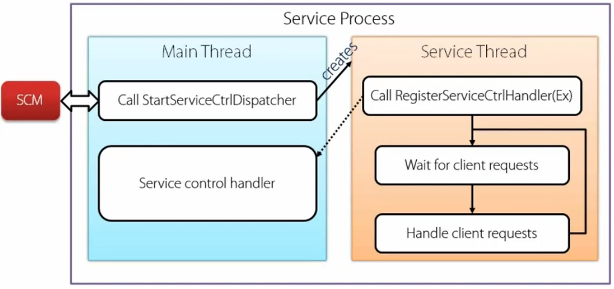
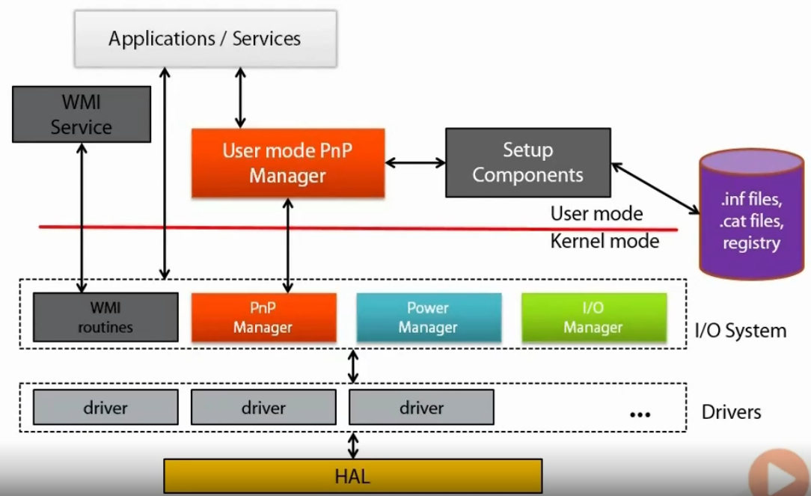
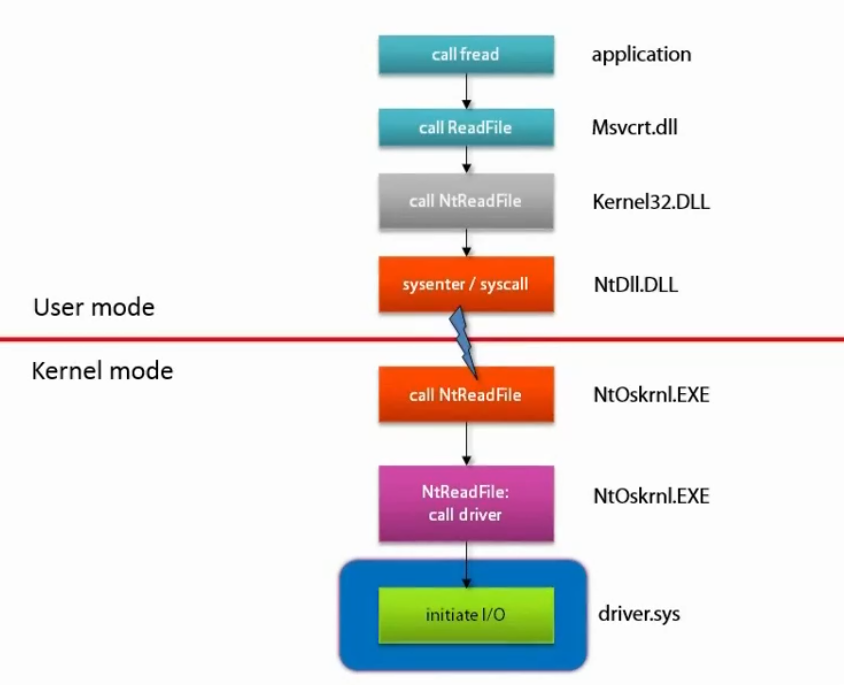
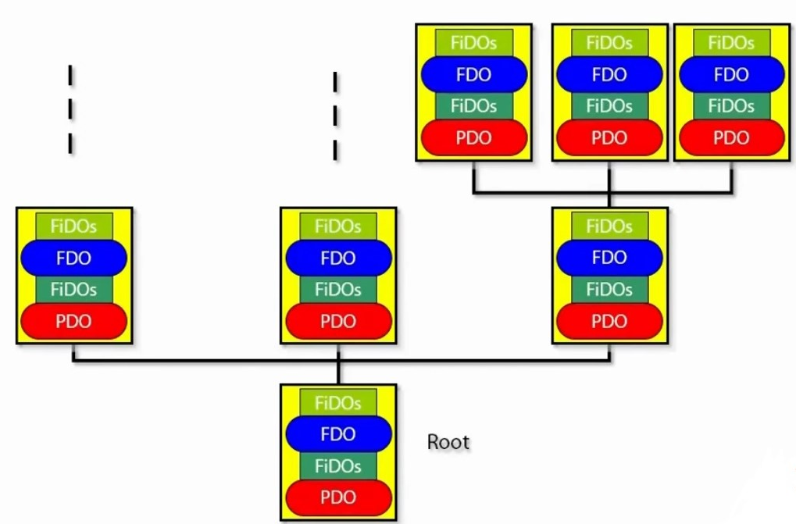
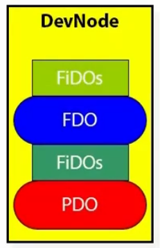
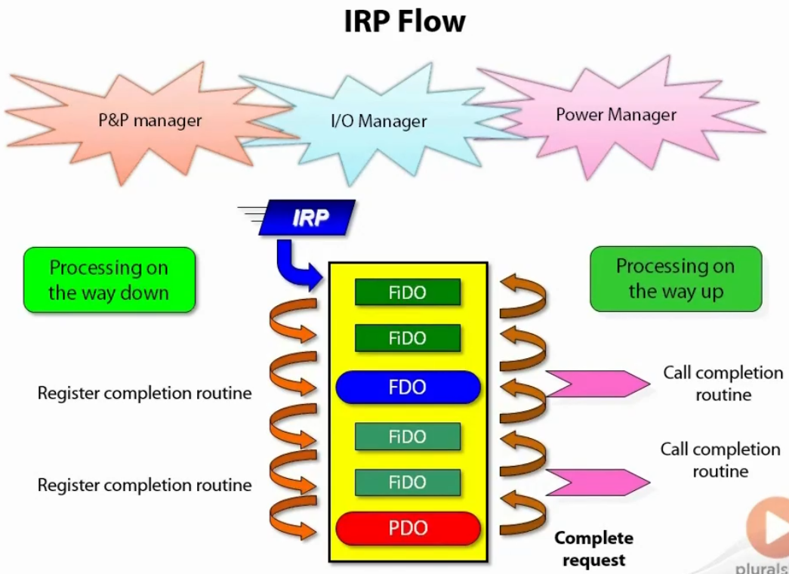
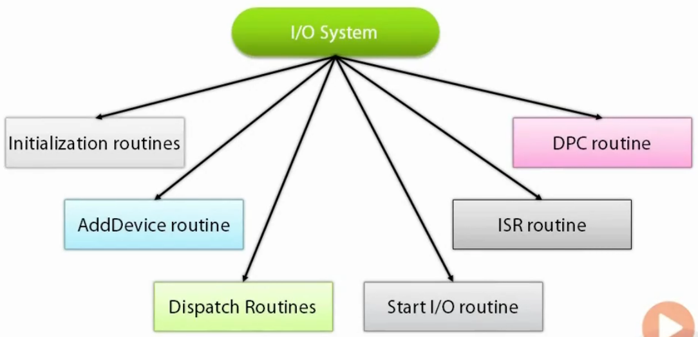
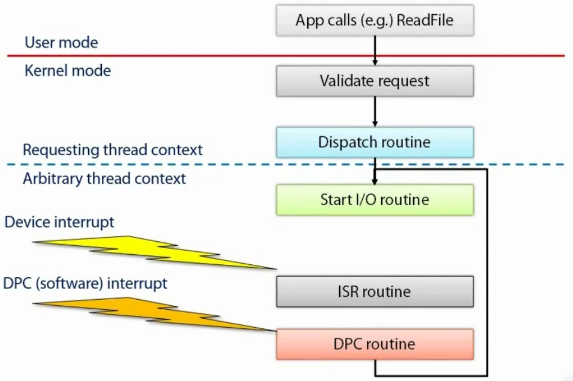
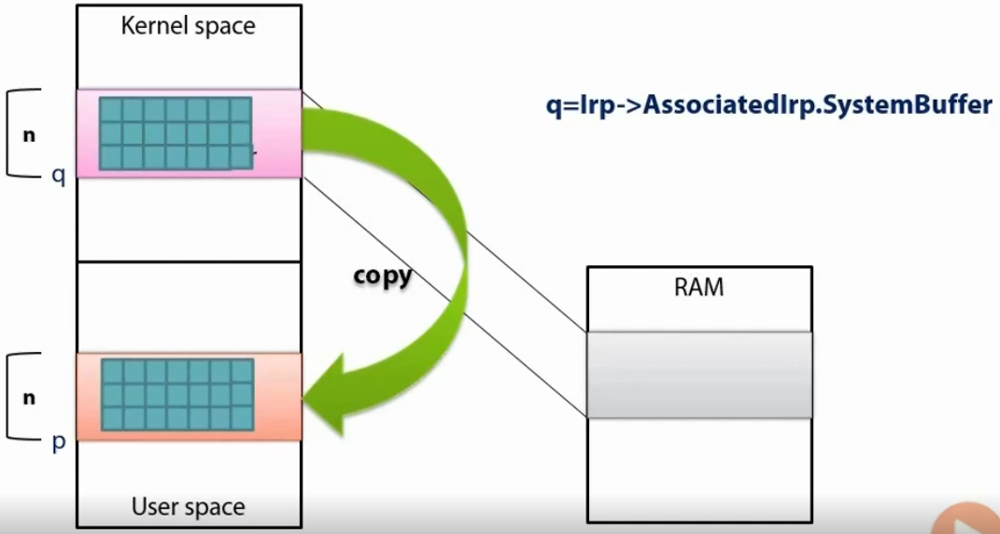
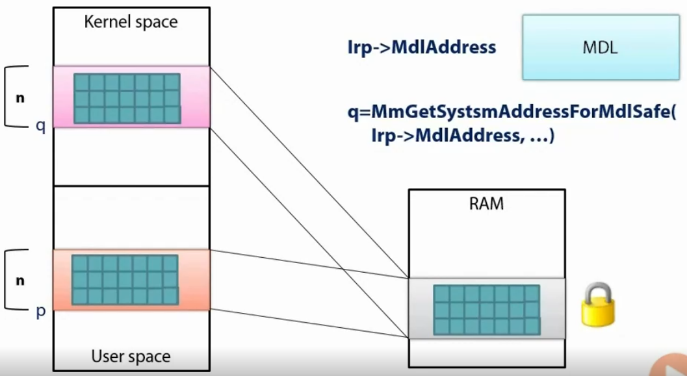

Windows Internals III
-------------------

***Services***

**Introduction to Services**  
- A Service Application is a program that provides some functionality without being tied to the logged on user (Services may run without any user logging in).
- Examples: IIS service and SQL server.  
- A service needs to register with Service Control Manager, SCM.  
- A service can be controlled by a Service Control Program, SCP.

**Service Characteristics**  
- A service is built just like any Win32 application.  
- It must be registered with SCM using CreateService API.  
- It communicates with the SCM using a named pipe.  
- It may run automatically when Windows boots, loaded by the SCM (services.exe).  
- It usually run under a special user account (Local system, network service or local service).  
- Service Control programs can manipulate a service (StartService, ControlService APIs).  

**Service Configuration**  
- A service application is installed by calling the CreateService API or any equivalent tool.  
- It inserts a new key into the registry under HKLM\System\CCS\Services.  
1- The entries in the Services key correspond to services and device drivers.  
- The services MMC snap-in can be used to view services only.  
- To start a service, a SCP calls the StartService API or any equivalent tool.

**Important Service Key Parameters**  
- Start  
1- SERVICE_BOOT_START (0) – Drivers only.  
2- SERVICE_SYSTEM_START (1) – Drivers only.  
3- SERVICE_AUTO_START (2) – Start service when the system starts.  
4- SERVICE_DEMAND_START (3) – Start service on demand (StartService API).  
5- SERVICE_DISABLED (4) – Do not start the service.  
- DelayedAutoStart  
1- Relevant to auto start services only.  
2- If true (1), a service is started some time after the SCM is started.  
- Type  
1- SERVICE_WIN32_OWN_PROCESS (16) – Runs in a process that hosts only one service.  
2- SERVICE_WIN32_SHARE_PROCESS (32) – Runs in a process that hosts multiple services.  
- ImagePath: The path to the service executable.  
- DisplayName  
1- The service name visible in the Services applet.  
2- If it’s not specified, the service key becomes the name.  
- Description: Textual description of the service.  
- ObjectName: The account under which the service process should execute.

**Service Architecture**

**Controlling Services**  
- Service Control Program, such as the Services MMC use the Windows API to control services.  
1- OpenSCManager: Opens a connection to the SCM.  
2- OpenService, CreateService: Opens a connection to an existing service or installs a new one.  
3- StartService: Starts a service.  
4- ControlService: Sends other commands to the service (stop, pause, etc).  
5- QueryServiceStatus: Returns current service status.  
6- DeleteService: Uninstalls a service.

**Service Accounts**  
- LocalSystem: Most powerful account on local computer and it should be used with cautions.  
- NetworkService  
1- It allows a service to authenticate outside the local computer.  
2- It has less privilege locally.  
- LocalService: It’s similar to NetworkService but can only be access network elements accepting anonymous access.

**Shared Service processes**  
- Some services run in their own process.  
- Some services are sharing a single process.  
1- Less system overhead of extra processes.  
2- If one service crashes, it brings down all other services in that process.  
3- All services running in a shared process run with the same account.  
- Microsoft uses the SvcHost.exe generic host to host multiple services within the same process.

**Trigger Start Services**  
- It was introduced in Windows 7.  
- Services can start with a certain trigger.  
- It cannot be configured using the Services MMC (must call ChangeServiceConfig2 API to do so).  
- Possible Triggers: Computer joins a domain, Device arrival, Firewall port open, Group or User policy change, IP address availability, Network protocol, ETW based.

***The I/O System***

**Introduction to the I/O System**  
- It abstracts logical and physical devices.  
- Most I/O system parts are within the executive and kernel.  
- It provides:  
1- Uniform naming mechanisms across devices and files.  
2- Uniform security model.  
3- Asynchronous packet I/O based.  
4- Support for Plug & Play.  
5- Dynamic loading and unloading of device drivers.  
6- Support for power management.  
7- Support for multiple file systems.

**I/O System Components**

**Device Drivers**  
- Device drivers are loadable kernel modules (The only official supported way to get 3rd party code into the kernel).  
- Classic device drivers provide the “glue” between hardware devices and the operating system.  
- Several ways to segregate device driver into categories  
1- User mode device drivers: Printer drivers and Drivers based on UDMF.  
2- Kernel mode drivers: File system drivers, Plug & Play drivers and Software drivers.

**Invoking a Driver**

**Plug & Play**  
- Automatic and dynamic recognition of installed hardware.  
1- Hardware detected at initial system installation.  
2- Recognition of PnP hardware changes between boots.  
3- Run-time response to PnP hardware changes.  
- Dynamic loading and unloading of drivers in response to hardware insertion or removal.  
- Hardware resource allocation and reallocation.  
- PnP manager may reconfigure resources at run-time in response to new hardware requesting resources that are already in use.

**Device Enumeration**  
- Upon boot, the PnP Manager performs enumeration of buses and devices.  
1- It starts from an imaginary root device.  
2- It scans the system recursively to the walk the device tree.  
- Bus driver creates a PDO for each physical device.  
- PnP Manager loads drivers  
1- It loads lower filter drivers (If exist).  
2- They create their FiDOs.  
3- It loads the function driver.  
4- It should create the FDO.  
5- It loads upper filter drivers (If exist).  
6- They create their FiDOs.

**Device Enumeration Tree**

**Important Registry Key**  
- Hardware instance keys: Information about a single device > HKLM\System\CCS\Enum (CCS = CurrentControlSet).  
- Class keys: Information about all devices of the same type > HKLM\System\CCS\Control\Class.  
- Software or Service keys: Information about a specific driver > HKLM\System\CCS\Services\drivername.  

**Device Node, DevNode**  
- It represents a stack of devices.  
- Physical Device Object, PDO: It’s created by the bus driver.  
- Filter Device Object, FiDO: Optional lower/upper device objects.  
- Functional Device Object, FDO: The actual driver created device object.  
- Stack of device, not drivers.

**I/O Request Packet, IRP**  
- A structure representing some request.  
1- Represented by the IRP structure.  
2- Contains all details needed to handle the request (codes, buffers, sizes, etc).  
- Always allocated from non-paged pool.  
- Accompanied by a set of structures of type IO_STACK_LOCATION.  
1- Number of structures in the number of the devices in this DevNode.  
2- Complements the data in the IRP.  
- IRPs are typically created by the I/O Manager, PnP Manager or the Power Manager.  
1- Can be explicitly created by drivers as well.

**IRP Flow**

**Accessing Devices**  
- A client that wants to communicate with a device must open a handle to the device.  
1- CreateFile or CreateFile2 from user mode (System.IO.FileStream class in .NET).  
2- ZwCreateFile from kernel mode.  
- CreateFile accepts a filename which is actually a device symbolic link.  
1- file being just one specific case.  
2- The name should have the format \\.\name for devices.  
3- Cannot access non-local device.  
4- Must use double backslashes “\\\\.\\name” in C/C++.

**Asynchronous I/O**  
- The I/O Manager supports an asynchronous model.  
1- Client initiates request, may not block, and get a notification later.  
- Device drivers must be written with asynchrony in mind.  
1- Should start an operation, mark the IRP as pending and return immediately.  
- The I/O Manager supports several ways of receiving a notification when the operation completes.  
- To use I/O asynchronously, CreateFile must be called with the FILE_FLAG_OVERLAPPED flag.  
- Other I/O functions must provide a non-null OVERLAPPED structure pointer.

***Device Drivers***

**Kernel Device Drivers**  
- Always execute in kernel mode.  
1- Use the kernel mode stack of a thread.  
2- Image part of system space.  
3- Unhandled exceptions will crash the system.  
- Typically has a SYS file extension.  
- Usually invoked by clients code (ReadFile, WriteFile, DeviceControl, etc).  
- Exports entry points for various functions (called by system code when it’s appropriate).  
- System handles all device independent aspects of I/O and there’s no need for hardware specific code or assembly.

**Plug & Play Drivers**
- Communicate with the PnP Manager and the Power Manager via IRPs.
- Driver types:  
1- Function driver: Manages the hardware device. The driver that knows the device intimately.  
2- Bus driver: Manages a bus (PCI, USB, IEEE1394, etc). Written by Microsoft.  
3- Filter drivers: Sit on top of a function driver (upper filter) or on top of a bus driver (below the function driver, lower filter), They also allow intercepting requests.

**Anatomy of a Driver**

**Driver and Device Objects**
- Drivers are represented in memory using a DRIVER_OBJECT structure.  
1- Created by the I/O system.  
2- Provided to the driver in the DriverEntry function.  
3- Holds all exported functions.  
- Device objects are created by the driver on a per-device basis.  
1- Represented by the DEVICE_OBJECT structure.  
2- Typically created in the Driver’s AddDevice routine.  
3- Severalty can be associated with a single driver object.

**Typical IRP Processing**

**Referencing User Buffers**
- Buffers provided in user space are not generally accessible from an arbitrary thread context and/or high IRQL>=2.  
- The I/O system provides ways to mitigate that.  
- Buffered I/O  
1- Transfer is to-and-from an intermediate buffer in system address space.  
2- I/O Manager does all of the setup work.  
- Direct I/O  
1- Transfer is to-and-from user’s physical pages.  
2- I/O Manager does not most of the setup work.

**Buffered I/O**

**Direct I/O**

**The Windows Driver Model, WDM**  
- Drivers for Windows 95 and NT4 were completely separate.  
- WDM is a model for writing device drivers.  
1- Mostly source compatible between Windows 98/ME and Windows 2000/XP.  
2- Supports a wide range of buses such as PCI, USB, IEEE1394 and more.  
3- Extensible to support future buses.  
4- Supports a wide range of device classes such as HID, Scanners, Cameras and more.  
5- Can still be used today.  
- File system drivers and Video drivers are not included in WDM.  
- WDM shows its age.

**The Windows Driver Foundation, WDF**  
- A new driver model which was introduced in Windows Vista.  
- WDF has two distinct parts:  
1- KMDF: Kernel Mode Driver Framework.  
2- UDMF: User Mode Driver Framework.  
- KMDF is a replacement for WDM.  
1- Consistent object based model (properties, methods and events).  
2- Boilerplate PnP and Power code implemented by the framework.  
3- Object lifetime management.  
4- Versioning with side by side support.  
- UMDF  
1- Allows building drivers in user mode (easier development and debugging).  
2- Works for certain device categories.  
3- UMDF 1.x is based around the Component Object Model, COM.  
4- UMDF drivers hosted in a system supplied host (WDFHost.exe).  
5- Object model similar in concept to KMDF.  
6- UMDF 2.0 was introduced in Windows 8.1  
7- Near identical object model compared to KMDF.  
8- Some form of translation is possible both ways.

**Driver Installation**  
- Drivers for hardware devices must be installed with an INF file.  
- INF file:  
1- Text file, format similar to the classic INI file.  
2- Sections in square brackets and instructions as key=value pairs.  
3- INF looked up by hardware ID and compatibles IDs.  
4- Precise matches are proffered.  
5- Digitally signed files and Newer files are preferred.  
- Installed INF files are stored in %SystemRoot%\INF.  
- User mode PnP service requests INF file if no match found in the system.

**Driver Verifier Options Examples**  
- I/O verification > IRPs are allocated from a special pool and monitored in various ways.  
- Special pool >  The driver’s allocations will be made from a special pool and monitored for overruns, underruns and illegal usage.  
- Forcing IRQL checking >  Forces paging of all paged driver code/data, forcing checks of correct behavior in IRQL and Spin Lock usage.  
- Low resources simulation > Causes random failure in memory allocations.

***Writing Software Device Drivers***

**Introduction**  
- A software driver does not manage any hardware.  
- Typically used as a method to get code to run in kernel mode.  
- Examples: Process Explorer and Process Monitor.  
- This means:  
1- No AddDevice routine needed.  
2- Driver exports a well-known name for the only device.  
3- Installation does not have to use an INF file.

**The DriverEntry Function**  
- The main function called when the driver first loads.  
- Should fill exported functions supported by the driver.  
- Unload routine:  
1- Setup in DriverEntry.  
2- Responsibility: Undo everything that was done in DriverEntry and any required cleanup.  
- AddDevice (for hardware based drivers).  
- Dispatch routines.  
- For a software driver  
1- Creates the one and the only device object.  
2- Creates a symbolic link so the device can be accessed from user mode.

**Installing the Driver**  
- A software driver can be installed just like a service (using SC.exe command line tool).  
- You need to specify a kernel driver type and you start right after that.

**Dispatch Routines**  
- Dispatch routines are a set of functions for particular operations (Read, Write, PnP, Power,….).  
- Set up in DriverEntry in the MajorFunction array of function pointers.  
- A driver must set the IRP_MJ_CREATE and IRP_MJ_CLOSE entries which makes CreateFiles and CloseHandle possible.  
- Unset entries will return an unsupported operation to the caller.

**Testing the Driver**  
- Once Create and Close exist, we can open a handle to the device.  
- Using CreateFile with the following semantics:  
1- FileName should be \\.\SymbolicLinkName.  
2- GENERIC_READ and GENERIC_WRITE flags to allow read/write access.  
3- OPEN_EXISTING flag is the only one that makes sense.  
- If anything goes wrong, the returned handle is INVALID_HANDLE_VALUE (-1) which can call GetLastError() to get specific error information.

**Implementing Device Control**  
- For Device Control, we need to define a control code.  
1- Using the CTI_CODE macro.  
2- In a header file that’s also accessible by client code.  
- CTL_CODE also sets up the buffering method.  
1- METHOD_BUFFERED is a common choice since buffers are typically small.  
- Important request parameters are in the current I/O stack location.

Download from [here](https://drive.google.com/file/d/10XclWsp95DtmtGY6kqB0jYwTNDHQiXNa/view?usp=sharing).  
ادعولي :)
---------

Disclaimer: I don't own the previous content.. They are just my studying notes.  
All rights reserved to Pavel Yosifovich and Pluralsight.

